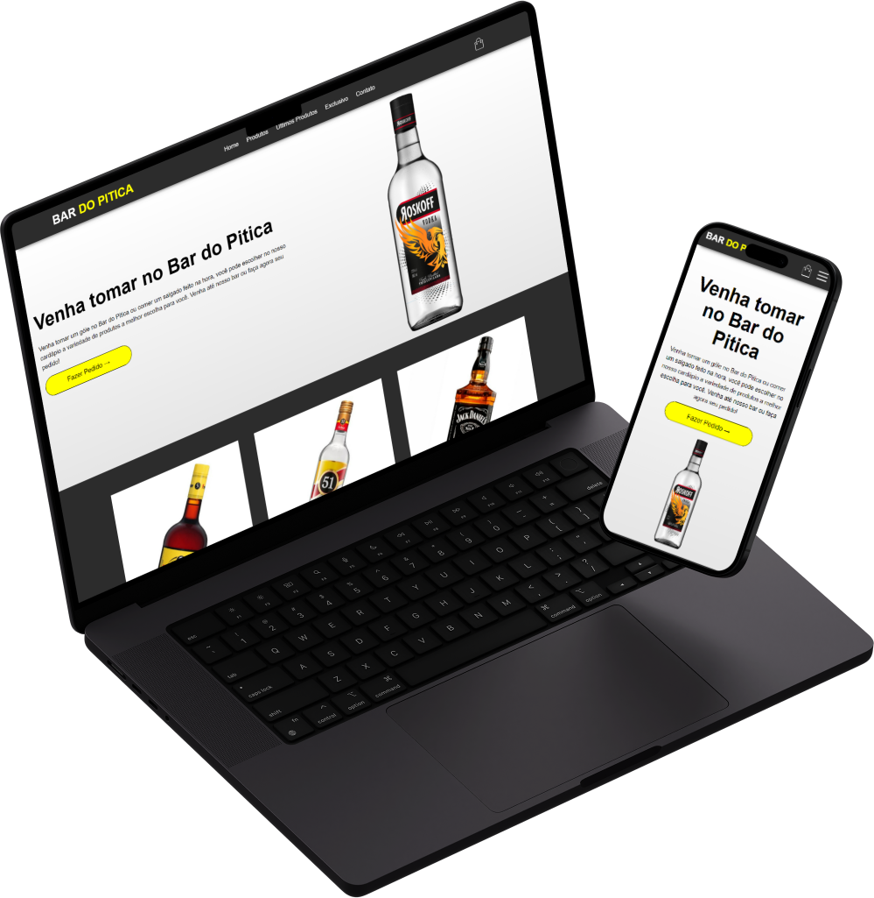

# Bar do Pitica - Ecommerce

 

  

 

Este projeto visa criar uma plataforma online onde os clientes podem comprar bebidas, petiscos, etc. Os clientes podem navegar pelos produtos, realizar pedidos. Com isso, o projeto proporciona conveniência aos clientes, amplia o alcance do bar e aumenta as vendas.

 

## 🚀 Tecnologias usadas:

 

- [HTML](https://developer.mozilla.org/pt-BR/docs/Learn/HTML/Introduction_to_HTML/Document_and_website_structure)
- [CSS](https://developer.mozilla.org/pt-BR/docs/Web/CSS)
- [Javascript](https://developer.mozilla.org/pt-BR/docs/Web/JavaScript)
